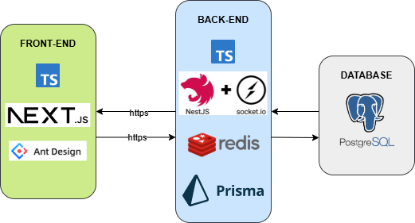
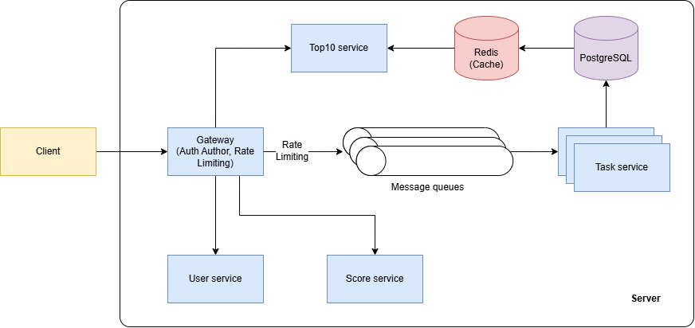
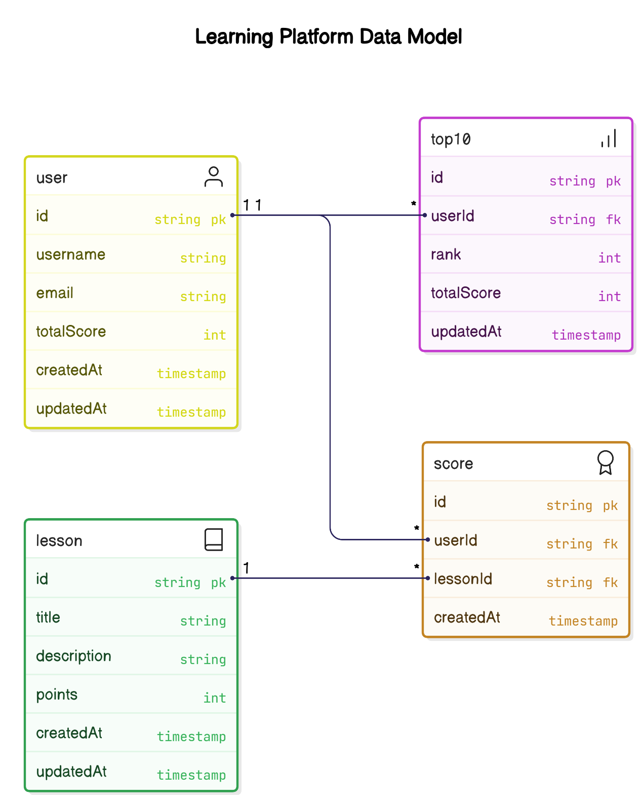
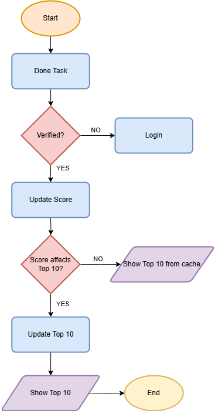

# Problem 6
## Table Of Contents
- [Introduction](#introduction)
- [Scope](#scope)
- [Requirements](#requirements)\
- [Technologies Used](#technologies-used)\
- [Architecture](#architecture)
- [ERD](#erd)
- [Flow Diagrams](#flow-diagrams)
- [API Design](#api-design)
- [Why Microservices](#why-microservices)
- [Why PostgreSQL](#why-postgreSQL)
- [Why SocketIO](#why-socketIO)
- [Security Considerations](#security-considerations)

## Introduction
This module is designed for a learning system where users earn points by completing English lessons. The primary objective of this module is to update the user’s score in real-time, ensuring the scoreboard always reflects the top 10 users accurately. The module also includes security measures to prevent unauthorized score manipulation.

## Scope
Handle score updates only when a user completes an English lesson.

Exclude detailed logic for point calculation (e.g., based on difficulty level or completion time).

Exclude handling of other lesson types.

## Requirements
The website displays a scoreboard showing the top 10 users' scores.
The scoreboard must have live updates.
Users earn points by completing English lessons.
Completing a lesson triggers an API call to update the score.
Security measures must prevent unauthorized score manipulation.

## Technologies Used
NestJS
Prisma
PostgreSQL
Socket.IO
Redis


## Architecture
This system is built using Microservice Architecture to achieve scalability and maintainability. It includes:

API Gateway: For authentication, authorization, and rate limiting.
Microservices:
User Service: Manages user information and totalScore.
Score Service: Handles score updates.
Task Service: Manages tasks and triggers score updates.
Top10 (LeaderRank) Service: Maintains the top 10 leaderboard.
Message Queues: For reliable communication between services.
WebSocket (Socket.IO): For real-time leaderboard updates.
PostgreSQL Database: Central storage for user data, scores, tasks, and leaderboard.

Refer to the Architecture Diagram for details.


## ERD
Refer to the ERD Diagram for the detailed schema and relationships.


## Flow Diagrams
Refer to the Flowchart Diagrams for detailed steps.


## API Design
### 1. Score Update
Endpoint: POST /api/v1/score/update
Description: Updates the user's score when a lesson is completed.
**Request Body:**
```json
{
  "userId": "string",
  "taskId": "string"
}
```
**Response:**
```json
{
  "message": "Score updated successfully",
  "totalScore": "number"
}
```

**Security:**
Requires Authorization Token.
Rate Limiting applied to prevent abuse.

### 2. Get Leaderboard
Endpoint: GET /api/v1/leaderboard/top10
Description: Retrieves the top 10 users on the leaderboard.
**Response:**
```json
[
  {
    "rank": "number",
    "userId": "string",
    "username": "string",
    "totalScore": "number"
  }
]
```
**Cache:**
Utilizes Redis Cache for quick retrieval.
Cache is invalidated and updated on score changes.

### 3. Get User Score
Endpoint: GET /api/v1/score/user/{userId}
Description: Retrieves the total score of a specific user.
**Response:**
```json
{
  "userId": "string",
  "totalScore": "number"
}
```

## Why Microservices?
Scalability: Each service can be scaled independently.
Maintainability: Modular design for easier updates and maintenance.
Reliability: Failures are isolated, reducing system-wide impact.

## Why PostgreSQL?
Timescale Utility: Postgre's Timescale can process time series data very efficiently.
ACID Compliance: Ensures data consistency and integrity.
Performance: Optimized for read-heavy operations like leaderboard queries.

## Why SocketIO?
Real-time communication: Enables live updates without refreshing the page. This satisfies the original request.
Cross-platform support: Works seamlessly on web and mobile platforms.

## Security Considerations
Rate Limiting:Implemented in API Gateway to prevent score manipulation.
Authentication & Authorization: Secures score update endpoints.
Data Validation: Input validation to prevent injection attacks.